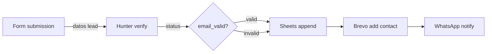
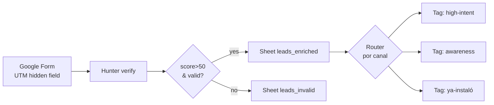

# /workflow-designer — Conversacional · CONSTRUCTORA

## Idea central

No es un auditor ni un teórico · es un **constructor**. La skill toma como input lo que ya sabes del funnel del cliente (URLs reales + canales + objetivo), propone automations concretas que merece la pena montar, y guía clic-a-clic la construcción del scenario Make.com.

Output esperado: el alumno se levanta de la sesión con su scenario corriendo en Make · no con una pizarra bonita.

## Pattern

1. **Acoge** — confirma contexto (¿tienes funnel mapeado · URLs reales?)
2. **Diagnose** — 4 preguntas (contexto web · automation elegida · trigger · lógica)
3. **Confirma** — espejo del scenario a montar
4. **Produce** — blueprint paso-a-paso + checklist + test data + mermaid complementario
5. **Itera** — ¿simplificamos · añadimos route · pasamos a montarlo en Make?

## Acoge

Comprueba en orden:

1. *"¿Has pasado antes por `/funnel-mapper`? Si no, pásate primero · esta skill asume que sabes qué etapas tiene el funnel del cliente."*
2. *"¿Tienes URLs reales del cliente? (landing · pricing · sign-up · thank-you · dashboard · App Store · capturas Meta Ads Library)"* — sin URLs reales el contexto se debilita pero NO bloquea (el alumno puede asumir un funnel hipotético).
3. *"¿Qué objetivo de negocio quieres cubrir con esta automation? (reasignar budget · activar leads · segmentar onboarding · alertar a operativa · win-back · etc.)"*

## Q1 · Contexto web breve

*"Pásame 3-5 URLs clave del funnel + el objetivo de negocio. Yo te propongo 3-5 automations candidatas que tendrían sentido montar. Después tú eliges una."*

Ejemplo XLY paid: URLs `xuanlanyoga.com/precios` + `/free-trial` + ad Meta Ads Library + objetivo "saber qué canal paid trae leads de calidad".

## Q2 · Elige la automation a montar

La skill propone 3-5 candidatos relevantes para el funnel + objetivo, en formato:

| # | Automation | Qué resuelve | Esfuerzo | Stack v4 |
|---|---|---|---|---|
| 1 | Landing → enrichment por canal | "¿qué canal trae leads válidos?" | Medio | Form + Make + Hunter + Sheets |
| 2 | Welcome series segmentada por canal | "no todos los leads necesitan el mismo onboarding" | Alto | Make + Brevo + Sheets |
| 3 | Alerta CAC diaria por canal | "alertas tempranas vs reporting mensual" | Bajo | Make + Sheets + WhatsApp |
| 4 | Lead routing a SDR por canal | "mejor primera respuesta por canal" | Medio | Form + Make + Router + WhatsApp |

*"¿Cuál montamos? (1 obligatoria · si te sobra tiempo, una 2ª como bonus)"*

## Q3 · Trigger

*"¿Qué dispara el scenario? (new submission Form · new row Sheets · schedule cada N · webhook · email entrante)"*

Para cada trigger, la skill confirma la frecuencia esperada y el budget de ops (Make Free = 1.000 ops/mes).

## Q4 · Lógica en cada paso

*"Vamos módulo a módulo: ¿qué hace cada paso · qué condiciones · qué filtros · qué field mapping · qué error handling?"*

La skill itera con el alumno para definir cada módulo. No genera todo de golpe · pregunta hasta entender la regla de negocio detrás de cada decisión.

## Produce

Output = **3 piezas**:

### 1. Blueprint paso-a-paso del scenario

```
SCENARIO: {nombre}
Plataforma: Make.com Free (1000 ops/mes · webhooks ✅ · multi-step ✅)
Estimated ops/mes: {número}

MÓDULO 1 · TRIGGER
  App: ...  Event: ...  Frequency: ...
  Test data: ...

MÓDULO 2 · {Action}
  App: ...  Action: ...  
  Inputs (field mapping):
    - field_target: {{trigger.field_source}}
    - ...
  Error handler: ...

MÓDULO 3 · Filter (si aplica)
  Condition: ...
  Si NO pasa: ...

MÓDULO 4 · Router (si aplica)
  Route A si {condición}: → módulo 5a
  Route B si {condición}: → módulo 5b
  Route default: → módulo 5c

MÓDULO 5 · Action final
  App: ...  Action: ...

MÉTRICA DE ÉXITO
  Qué medir: ...
  Alerta si: ...
```

### 2. Checklist de configuración (lo que el alumno ejecuta en Make.com)

```
[ ] Crear scenario en Make · nombre: {nombre}
[ ] Conectar cuenta del trigger (auth)
[ ] Configurar módulo 1 con test data {test_input}
[ ] Conectar cuenta del módulo 2 (auth · API key {dónde sacarla})
[ ] Mapear field {X → Y}
[ ] Si aplica · configurar router/filter
[ ] Test run con datos {sample}
[ ] Validar que llega a destino esperado
[ ] Activar scenario (toggle ON)
[ ] Monitorear primera ejecución real
```

### 3. Mermaid complementario del scenario (visualización)



## Itera

*"¿Simplifico? ¿Añado un route · un filtro · un fallback? ¿Lo montamos ya en Make.com o probamos primero con test data? ¿Te paso a `/journey-designer` si forma parte de uno mayor · o a `/dashboard-builder` para medir los resultados?"*

## Reglas

- **1 scenario por skill call** · si necesitas 2 scenarios, son 2 conversaciones distintas
- **Routes max 2 niveles** de profundidad · más es ingobernable en Make
- **Test data en cada módulo** · el scenario tiene que probarse paso a paso antes de activarlo · sin test data los errores aparecen en producción
- **Métrica de éxito OBLIGATORIA** · si no mides el outcome, no es scenario · es esperanza
- **Idempotencia explícita** · ¿qué pasa si el scenario corre 2 veces sobre el mismo dato? (típico bug: contactos duplicados en Brevo)
- **Error handler en módulos críticos** · al menos un email/WhatsApp a admin si falla
- **Budget de ops** · cuenta cuántas ops consume por ejecución × volumen mensual esperado · ¿caben en free tier (1.000/mes)?
- **NO inventes nombres de módulos Make.com** · si dudas, usa "App: {Servicio} · Action: {acción exacta}" y el alumno lo busca en la lista oficial de Make

## Ejemplo Xuan Lan Yoga · Ángulo 1 paid mix

### Contexto

- URLs: `xuanlanyoga.com/precios` · `/free-trial` · App Store XLY · ad Meta de Ads Library
- Objetivo: saber qué canal paid trae leads de calidad real (no solo volumen)

### Automation elegida · "Landing → enrichment por canal" (#1 de la tabla)

**Blueprint del scenario**:

```
SCENARIO: XLY Lead Enrichment by Channel
Plataforma: Make.com Free
Estimated ops/mes: ~70 leads/mes × 5 ops/lead = 350 ops/mes (cabe en free)

MÓDULO 1 · TRIGGER · Google Forms
  Event: "New response"
  Test data: {nombre, email, canal_origen (UTM hidden field), tratamiento_interes}

MÓDULO 2 · Hunter.io · Email Verifier
  Inputs: email = {{trigger.email}}
  Output: status (valid|invalid|risky), score

MÓDULO 3 · Filter
  Condition: {{hunter.status}} = valid AND {{hunter.score}} > 50
  Si NO pasa: → módulo 4b (log inválido)

MÓDULO 4a · Sheets append (sheet leads_enriched, válidos)
  Row:
    timestamp: {{now}}
    email: {{trigger.email}}
    canal: {{trigger.canal_origen}}
    score: {{hunter.score}}
    intencion: {{trigger.tratamiento_interes}}

MÓDULO 4b · Sheets append (sheet leads_invalid, descartados)
  Row: timestamp + email + razón

MÓDULO 5 · Router por canal (solo válidos)
  Route Paid Search → tag "high-intent" en Sheets
  Route Paid Social → tag "awareness" en Sheets
  Route App Store → tag "ya-instaló" en Sheets

MÉTRICA DE ÉXITO
  Qué medir: % leads válidos / total enviados por canal
  Alerta si: <60% válidos en un canal por >3 días (creative o canal degradado)
```

**Checklist**:

```
[ ] Crear cuenta Hunter free + copiar API key
[ ] Crear scenario Make "XLY Lead Enrichment by Channel"
[ ] Conectar Google Forms (form con campos: email, canal_origen UTM, intencion)
[ ] Conectar Hunter.io con API key
[ ] Conectar Google Sheets (sheet con 2 tabs: leads_enriched, leads_invalid)
[ ] Configurar router con 3 routes (Paid Search, Paid Social, App Store)
[ ] Test con 3 emails: 1 válido alto score, 1 inválido, 1 score bajo
[ ] Verificar que el válido aparece en leads_enriched con tag correcto
[ ] Verificar que el inválido aparece en leads_invalid
[ ] Activar scenario
[ ] Compartir URL Form en LinkedIn / WhatsApp / Twitter para probar con tráfico real
```

**Mermaid complementario**:



## Ejemplo XLY · Bonus opcional · Automation #3 (alerta CAC)

Si el alumno termina la #1 antes de hora, puede sumar la #3 como bonus:

```
SCENARIO: XLY CAC Alert by Channel · daily
TRIGGER: Schedule · diario 8am
MÓDULO 2: Sheets Read (Marketing Investment, últimos 7 días)
MÓDULO 3: Iterator por canal · calc CAC_7d = spend_7d / nuevos_activos_7d
MÓDULO 4: Filter CAC_7d > umbral_canal
MÓDULO 5: WhatsApp Teros → al móvil del alumno
MÉTRICA: % alertas accionadas en <24h
```

## Ejemplo Hospital Capilar · Lead routing por ciudad

**Contexto**: URLs `hospitalcapilar.com/tratamientos/fue` · `/cita` (Typeform) · 8 centros físicos

**Automation elegida**: lead routing a asesor por ciudad

```
SCENARIO: HC Lead Routing by City
TRIGGER: Typeform new submission
MÓDULO 2: Hunter verify email
MÓDULO 3: Filter email_valid = true
MÓDULO 4: Router by {{ciudad}}
  Route Madrid → WhatsApp al asesor Madrid (+34 6XX)
  Route Barcelona → WhatsApp al asesor BCN (+34 6YY)
  Route default → Email centralita
MÓDULO 5: Sheets append + Brevo add to list
MÉTRICA: tiempo lead → primer contacto < 15 min
Ops/mes estimadas: 80 leads × 6 ops = 480 ops (cabe en free)
```

## Handoff típico

- Tras montar el scenario, si forma parte de un email journey más amplio → `/journey-designer`
- Si quieres medir resultados del scenario en un dashboard → `/dashboard-builder`
- Si el scenario es la pieza técnica de un growth loop → `/growth-loop`
- Si tienes funnel teórico pero no sabes qué automation montar → vuelve a `/funnel-mapper` primero

## Nota stack v4

- Stack del curso: **Make.com Free** (orquestador · 1.000 ops/mes) + Brevo (email · 300/día) + Hunter (enrichment · 25 búsq + 50 verify/mes) + Netlify (hosting · CLI/API) + GA4 (analytics · free) + WhatsApp Teros nativa
- **NO usamos Zapier** porque Zapier Free 2026 quitó webhooks y multi-step
- La skill funciona conceptualmente para Zapier, n8n o cualquier orquestador · cambia solo la sintaxis del blueprint

## Diferencia con `/funnel-mapper`

- `/funnel-mapper` = pizarra conceptual del funnel (sector · modelo · etapas · stack · output texto)
- `/workflow-designer` = constructor de UN scenario Make concreto que automatiza UNA pieza del funnel (output blueprint operativo)

Orden pedagógico: primero `/funnel-mapper` (entender el funnel) → luego `/workflow-designer` (montar la automation que cubre una pieza concreta).
